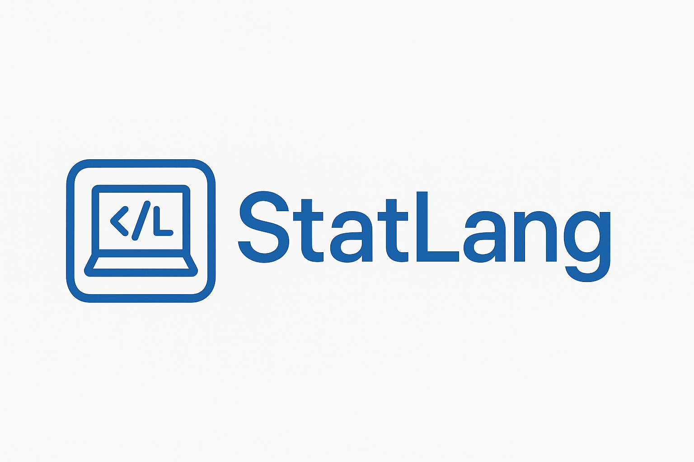

# StatLang

<div align="center">
  
  <h3>An open-source, Python-based statistical scripting language</h3>
  <p>Write and run statistical scripts with full syntax highlighting and a Python backend.</p>
</div>

## Overview

StatLang provides an open-source environment for statistical analysis by offering:
- **Expressive scripting syntax** for data manipulation and analysis
- **Python backend** for execution and performance
- **Jupyter notebook support** with a StatLang kernel
- **VS Code extension** with syntax highlighting and execution
- **Cross-platform compatibility** (Windows, macOS, Linux)
- **Open source** and free to use

### What Makes StatLang Special?

- **AI Integration**: Built-in **PROC LANGUAGE** with LLM capabilities for intelligent data analysis
- **Complete ML Pipeline**: From data exploration to model deployment using familiar, concise syntax
- **Deep Learning**: PyTorch-powered DNN training, NLP, computer vision (including object detection), and reinforcement learning
- **Modern SQL**: **PROC SQL** powered by DuckDB for high-performance data querying
- **Robust language features**: Macro system, format system, and 38+ statistical/ML procedures
- **Rich Visualizations**: Professional output formatting with TITLE statements and structured results

## Features

### Core Interpreter
- DATA step with MERGE, ARRAY, RETAIN, DO loops (iterative/while/until), FIRST./LAST., LAG/DIF
- INFILE/FILE I/O, INPUT parsing, and PUT output
- DATALINES/CARDS for inline data
- Subsetting IF and conditional IF/THEN/ELSE
- Row-by-row and vectorised execution paths
- Python pandas/numpy backend for performance

### Macro System
- `%MACRO` / `%MEND` definitions with parameter lists
- `%LET`, `%PUT`, `&var` substitution
- `%IF` / `%THEN` / `%ELSE`, `%DO` / `%END` control flow
- `%INCLUDE` file injection (recursive with depth limit)
- `%SYSEVALF` arithmetic, `%SYSFUNC` (30+ built-in functions)
- `%GLOBAL` / `%LOCAL` scoping
- System variables: `&SYSDATE9`, `&SYSLAST`, `&SYSCC`, `&SYSJOBID`

### Model Store and Pipeline
- In-memory model store with optional pickle persistence
- Save, load, list, and delete trained models across procedures
- `run_pipeline()` for end-to-end `.statlang` file execution

### Jupyter Notebook Support
- StatLang kernel for Jupyter notebooks
- Interactive statistical programming in notebook environment
- Rich output display with formatted tables
- Dataset visualisation and exploration

### VS Code Extension
- Syntax highlighting for `.statlang` files
- Code snippets for common statistical analysis patterns
- File execution directly from VS Code
- Notebook support for interactive analysis

### Supported Procedures

#### Statistical Procedures
| Procedure | Description |
|-----------|-------------|
| **PROC MEANS** | Descriptive statistics with CLASS variables and OUTPUT |
| **PROC FREQ** | Frequency tables and cross-tabulations |
| **PROC SORT** | Data sorting with ascending/descending order |
| **PROC PRINT** | Data display and formatting |
| **PROC REG** | Linear regression with MODEL, OUTPUT, and SCORE |
| **PROC UNIVARIATE** | Detailed univariate analysis with distribution diagnostics |
| **PROC CORR** | Correlation analysis (Pearson, Spearman) |
| **PROC FACTOR** | Principal component and factor analysis |
| **PROC CLUSTER** | Clustering methods (k-means, hierarchical) |
| **PROC NPAR1WAY** | Nonparametric tests (Mann-Whitney, Kruskal-Wallis) |
| **PROC TTEST** | T-tests (independent and paired) |
| **PROC LOGIT** | Logistic regression |
| **PROC TIMESERIES** | Time series analysis and seasonal decomposition |
| **PROC SURVEYSELECT** | Random sampling (SRS, SAMPRATE/N, OUTALL) |
| **PROC GLM** | General Linear Models via statsmodels (Type III ANOVA) |
| **PROC ANOVA** | Balanced Analysis of Variance |
| **PROC GENMOD** | Generalised Linear Models (Gaussian, Binomial, Poisson, Gamma) |
| **PROC MIXED** | Mixed / multilevel models (random intercepts & slopes) |
| **PROC ROBUSTREG** | Robust regression (M-estimation via RLM) |
| **PROC LIFEREG** | Parametric survival (Weibull, Log-Normal, Log-Logistic AFT) |
| **PROC PHREG** | Cox proportional hazards regression |
| **PROC DISCRIM** | Discriminant analysis (LDA / QDA) |
| **PROC PRINCOMP** | Principal Component Analysis with StandardScaler |

#### Machine Learning Procedures
| Procedure | Description |
|-----------|-------------|
| **PROC TREE** | Decision trees for classification and regression |
| **PROC FOREST** | Random forests for ensemble learning |
| **PROC BOOST** | Gradient boosting |
| **PROC DNN** | PyTorch feedforward neural networks (classification & regression) |
| **PROC NLP** | HuggingFace NLP (sentiment, classification, NER, summarisation) |
| **PROC CVISION** | Image classification (ResNet, VGG) and Faster R-CNN object detection |
| **PROC RL** | Tabular Q-learning for reinforcement learning |
| **PROC LLM** | Text generation, fill-mask, and QA via HuggingFace |

#### Data Management Procedures
| Procedure | Description |
|-----------|-------------|
| **PROC TRANSPOSE** | Reshape data (wide / long) with BY group support |
| **PROC APPEND** | Concatenate datasets with FORCE option |
| **PROC DATASETS** | Delete, rename, and list datasets |
| **PROC EXPORT** | Export to CSV, Excel, JSON, Parquet |
| **PROC IMPORT** | Import from CSV, Excel, JSON, Parquet |
| **PROC SQL** | SQL query processing with DuckDB backend |
| **PROC LANGUAGE** | LLM-powered text generation, Q&A, and data analysis |

## Installation

### Python Package
```bash
# Core statistical procedures
pip install statlang

# With deep learning (PROC DNN, PROC CVISION, PROC RL)
pip install statlang[dl]

# With NLP (PROC NLP, PROC LLM)
pip install statlang[nlp]

# With DuckDB SQL engine (PROC SQL)
pip install statlang[sql]

# With Jupyter notebook support
pip install statlang[notebook]

# Everything
pip install statlang[all]
```

### Jupyter Kernel Installation
```bash
# Install the StatLang kernel
python -m statlang.kernel install

# List available kernels
jupyter kernelspec list
```

### VS Code Extension
1. Install from VS Code Marketplace: "StatLang" by RyanBlakeStory
2. Or install from source (see Development section)

## Quick Start

### 1. Interactive Python Usage
```python
from statlang import StatLangInterpreter

# Create interpreter
interpreter = StatLangInterpreter()

# Create sample data using StatLang syntax
interpreter.run_code('''
data work.employees;
    input employee_id name $ department $ salary;
    datalines;
1 Alice Engineering 75000
2 Bob Marketing 55000
3 Carol Engineering 80000
4 David Sales 45000
;
run;
''')

# Run statistical analysis
interpreter.run_code('''
proc means data=work.employees;
    class department;
    var salary;
run;
''')
```

### 2. Macro-Powered Pipeline
```statlang
%LET target = spend;
%LET features = age income;

%macro train_and_evaluate(depvar, indepvars);
    proc reg data=work.train;
        model &depvar = &indepvars;
        output out=work.results p=predicted r=residuals;
    run;

    proc means data=work.results mean;
        var residuals;
    run;
%mend;

%train_and_evaluate(&target, &features);
```

### 3. Object Detection (Deep Learning)
```statlang
/* Generate synthetic training data */
proc cvision mode=generate_samples out=annotations
     n_train=30 n_test=10 img_size=128 seed=42;
run;

/* Fine-tune Faster R-CNN */
proc cvision data=train_annot mode=train_detect
     model_name=shape_detector epochs=5 lr=0.005;
    image image_path;
run;

/* Score new images with the trained model */
proc cvision data=test_images mode=serve out=detections
     model_name=shape_detector confidence=0.5;
    image image_path;
run;
```

### 4. Jupyter Notebook Usage
1. Install the StatLang kernel:
   ```bash
   python -m statlang.kernel install
   ```
2. Create a new Jupyter notebook (`.ipynb`)
3. Select "statlang" as the kernel
4. Write StatLang code in cells and execute

### 5. VS Code Usage
1. Install the StatLang extension from the marketplace
2. Create a new file with `.statlang` extension
3. Write your StatLang code
4. Use `Ctrl+Shift+P` > "StatLang: Run File" to execute

### 6. Command Line Usage
```bash
# Run StatLang code from file
python -m statlang.cli run example.statlang

# Interactive mode
python -m statlang.cli interactive
```

## Examples & Demos

### ML Regression Project
**[ML Project Demo](examples/ML_project_in_statlang.ipynb)** - A comprehensive machine learning workflow:
- Synthetic dataset creation with 30 observations
- **PROC UNIVARIATE** for distribution analysis
- **PROC SURVEYSELECT** for train/test splitting (70/30)
- **PROC REG** with MODEL, OUTPUT, and SCORE statements
- Macro-based reusable analysis functions

### Object Detection Walkthrough
**[Object Detection Pipeline](examples/object_detection_walkthrough.ipynb)** - End-to-end computer vision:
- Synthetic shape data generation with bounding-box annotations
- Faster R-CNN fine-tuning with **PROC CVISION**
- Model store persistence and serving
- Composable `%MACRO` pipeline with `%LET`-driven configuration

### Comprehensive Walkthrough
**[StatLang Walkthrough](examples/statlang_walkthrough.ipynb)** - Complete feature demonstration:
- All statistical procedures with examples
- Macro system demonstrations
- Format system usage
- Advanced data manipulation techniques

## Project Structure

```
StatLang/
├── stat_lang/                  # Core Python package
│   ├── __init__.py
│   ├── interpreter.py          # Main interpreter
│   ├── cli.py                  # Command line interface
│   ├── pipeline.py             # End-to-end pipeline runner
│   ├── kernel/                 # Jupyter kernel implementation
│   │   ├── statlang_kernel.py
│   │   └── install.py
│   ├── parser/                 # Syntax parsers
│   │   ├── data_step_parser.py # DATA step (MERGE, ARRAY, DO, etc.)
│   │   ├── proc_parser.py      # Generic PROC option scanner
│   │   └── macro_parser.py
│   ├── procs/                  # 38+ procedure implementations
│   │   ├── proc_means.py       # Statistical procs
│   │   ├── proc_reg.py
│   │   ├── proc_glm.py
│   │   ├── proc_dnn.py         # Deep learning procs
│   │   ├── proc_cvision.py     # Computer vision / object detection
│   │   ├── proc_export.py      # Data management procs
│   │   └── ...
│   └── utils/
│       ├── expression_evaluator.py
│       ├── macro_processor.py  # Macro engine
│       ├── model_store.py      # In-memory + pickle model store
│       ├── data_utils.py
│       └── libname_manager.py
├── tests/                      # Test suite (55+ tests)
├── examples/                   # Example notebooks & scripts
├── vscode-extension/           # VS Code extension
├── media/                      # Logo and icons
├── pyproject.toml              # Package config & dependencies
└── README.md
```

## Development

### Setup Development Environment
```bash
git clone https://github.com/Stryve-Analytics/StatLang.git
cd StatLang
pip install -e ".[dev]"
```

### Running Tests
```bash
# Run the full test suite
pytest

# With verbose output
pytest -v --tb=short
```

### Linting & Type Checking
```bash
# Lint
ruff check stat_lang tests --select E,F,I --ignore E501

# Type check
mypy stat_lang tests
```

## Contributing

We welcome contributions! Please see [CONTRIBUTING.md](CONTRIBUTING.md) for guidelines.

### Areas for Contribution
- Additional statistical procedures
- Macro functionality enhancements
- Performance optimisations
- VS Code extension features
- Documentation and examples

## License

MIT License - see [LICENSE](LICENSE) for details.

## Support

- [Documentation](https://github.com/Stryve-Analytics/StatLang/wiki)
- [Issue Tracker](https://github.com/Stryve-Analytics/StatLang/issues)
- [Discussions](https://github.com/Stryve-Analytics/StatLang/discussions)
